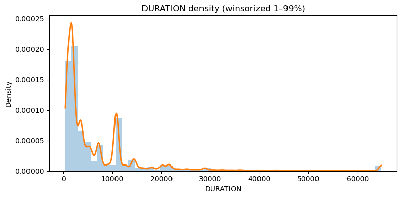
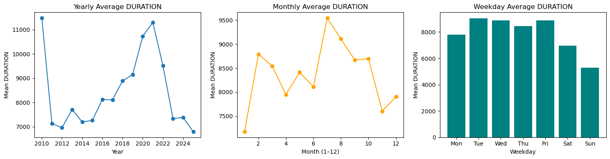
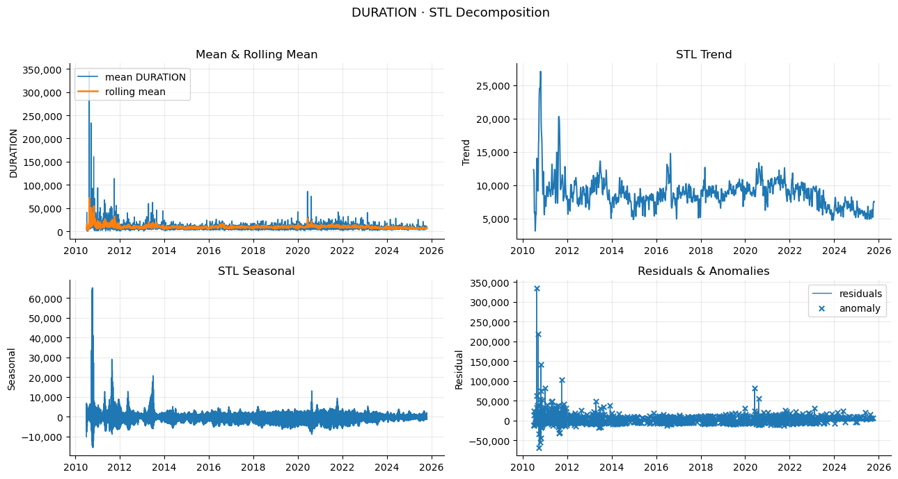
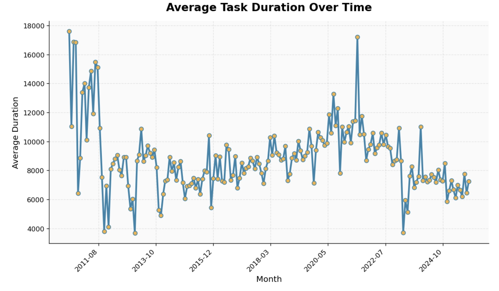

## 1. Environment Setup


1. **Install dependencies**
   ```bash
   pip install pandas numpy matplotlib seaborn jupyter pyarrow plotly
   ```

## 2. Load and Merge Tables

Make Sure all raw data are stored under the folder `data/click/`.

This will create a cleaned table in `data/cleaned_result/`. 

```python
python merge_table.py
```
It will automatic generate an html report for merged table.


## 3. Exploratory Data Analysis (EDA)

#### 1. Duration Analysis




